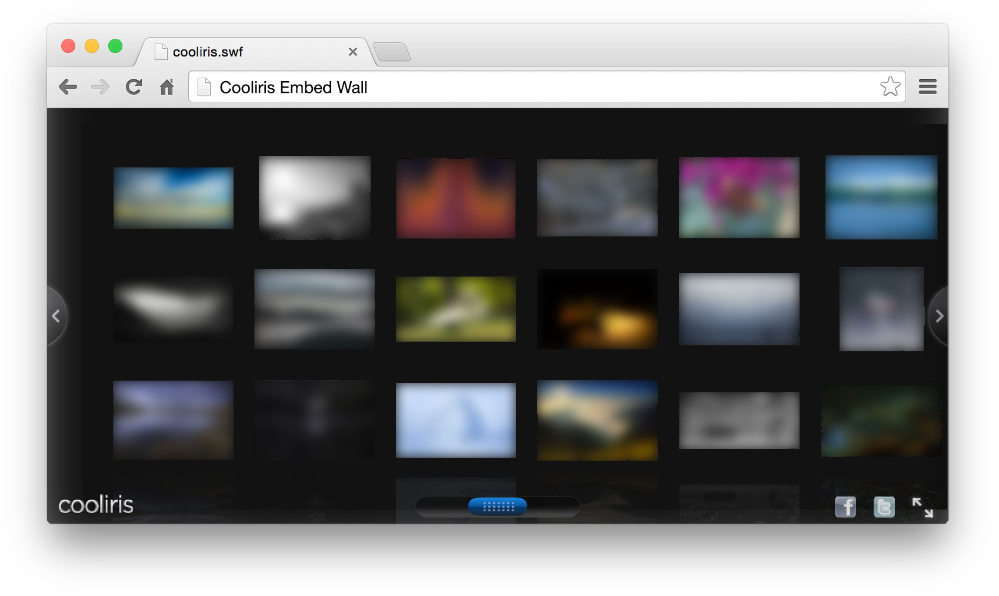

Cooliris Embed Wall
==========
**On March 1, 2015, the centrally-hosted version of the Embed Wall will stop working. If you would like to continue using the Embed Wall beyond this date, you can switch to using a copy hosted on your own site.**

# Overview

The Embed Wall was developed to enable web publishers to present photo and video content using the Cooliris Wall user interface. The Embed Wall fetches photos and videos from a supported source, and enables users to browse, view, and play slideshows.

The Embed Wall is no longer supported, and the centrally-hosted copy will become unavailable on March 1, 2015. Since many web properties still depend on it, we are making the SWF available for self-hosting to smooth the transition to a long-term solution.

### Caution

The Embed Wall is based on Adobe Flash. We recommend that you transition your experience to use another solution based on modern web standards. If you continue to use the Embed Wall, please consider the following:

* The Embed Wall is no longer supported, and we cannot guarantee that it will continue to work properly.
* The Embed Wall does not work on mobile browsers, or on desktop browsers without the Flash plugin.
* `api://` URLs for Facebook, Flickr, Picasa, and YouTube depend on hardcoded API keys, and therefore may stop working at some point.
* `http(s)://` URLs referencing Media RSS feeds are a more reliable option.

# Self-Hosting Guide

## Embed Code

If you are using an embed code, change the SWF URL to point at a self-hosted copy:

1. Host [cooliris.swf](cooliris.swf) at a URL on your web server.
2. Replace the `http://apps.cooliris.com/embed/cooliris.swf` link in the embed code with your URL.
3. In your embed code, change `allowScriptAccess` to `never`:
```html
<object id="…" classid="…" width="…" height="…">
  <param name="movie" value="http://{YOUR URL}/cooliris.swf"/>
  <param name="allowFullScreen" value="true"/>
  <param name="allowScriptAccess" value="never"/>
  <param name="bgColor" value="…"/>
  <param name="flashvars" value="feed=…"/>
  <param name="wmode" value="opaque"/>
  <embed type="application/x-shockwave-flash"
    src="http://{YOUR URL}/cooliris.swf"
    width="…"
    height="…"
    allowfullscreen="true"
    allowscriptaccess="never"
    bgcolor="…"
    flashvars="feed=…"
    wmode="opaque">
  </embed> 
</object> 
```

#### Centrally-Hosted Walls

If you used the Cooliris Express tool to generate an embed code, make sure that the `flashvars` in your embed code uses a `feed=…` parameter. If your embed code uses a `z=…` parameter, then you are using a centrally-hosted wall. In this case, we recommend that you switch to a feed URL, e.g. `flashvars="feed=http://your/media.rss"`. Centrally-hosted walls will stop working on March 1, 2015.

## JavaScript

If your page uses JavaScript to integrate more deeply with the Embed Wall, you can continue to do so by self-hosting the JavaScript bridge alongside the SWF.

1. Host [cooliris.swf](cooliris.swf) and [cooliris-embed.js](js/cooliris-embed.js) at URLs on your web server.
2. See [the JavaScript HTML example](js/example.html) for an example of how to initialize the JavaScript bridge with self-hosted SWF and JS files. The ordering is important:
  1. Include `cooliris-embed.js` to set up the `cooliris` global object.
  2. Set the `onEmbedInitialized()` callback to register for user interaction events.
  3. Insert the Embed Wall into the page.

The `cooliris.embed` API should continue to work as before.

## Help

We hope that the above information enables you to successfully self-host the Embed Wall as a bridge to a more long-term solution. If you have questions or feedback, please direct them to <team@cooliris.com>. While the Embed Wall is no longer officially supported, we will do our best to answer your questions through the transition period, ending March 1, 2015.

